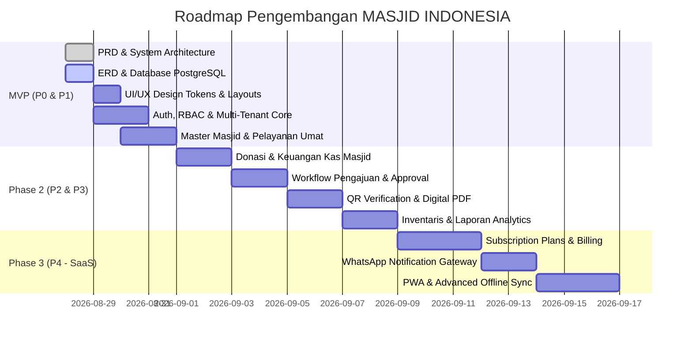

# PRODUCT REQUIREMENT DOCUMENT (PRD)
## MASJID INDONESIA — Digital Mosque Management Platform

**Document Version:** 1.0.0  
**Status:** Approved / In Progress  
**Author:** Senior Product & Software Architect  
**Tech Stack Target:** Laravel 11/12/13, PHP 8.3+, Neon PostgreSQL, Blade + Tailwind CSS + Alpine.js/Livewire  

---

## 1. PRODUCT OVERVIEW

### 1.1 Executive Summary
**MASJID INDONESIA** adalah platform digital manajemen masjid multi-tenant modern yang dirancang untuk mendigitalisasi seluruh aspek tata kelola, peribadatan, sosial-kemasyarakatan, keuangan, dan transparansi masjid di seluruh Indonesia.

### 1.2 Tagline & Vision
* **Tagline:** *"Digitalisasi Masjid, Menguatkan Umat."*
* **Visi:** Menjadi ekosistem digital tata kelola dan transparansi masjid terbesar, terpercaya, dan paling inklusif di Indonesia yang menghubungkan masjid, pengurus, jamaah, donatur, dan masyarakat luas secara aman dan transparan.
* **Misi:**
  1. Mentransformasi tata kelola masjid dari konvensional menjadi digital, rapi, dan terintegrasi.
  2. Meningkatkan akuntabilitas dan transparansi keuangan kas masjid serta program donasi/infaq/zakat/wakaf.
  3. Memfasilitasi interaksi dan syiar dakwah yang dinamis antara pengurus masjid, imam, khatib, dan jamaah.
  4. Menyediakan sistem verifikasi dokumen dan transaksi digital yang aman, anti-pemalsuan melalui validasi berbasis QR Code kriptografis.

### 1.3 Problem Statement
1. **Pencatatan Keuangan Manual & Rentan:** Banyak masjid masih menggunakan pembukuan fisik/buku kas tulis tangan atau spreadsheet terpisah yang rentan hilang, salah hitung, serta sulit diaudit oleh jamaah.
2. **Keterbatasan Transparansi Publik:** Jamaah dan donatur seringkali tidak memiliki akses informasi real-time mengenai penggunaan dana infaq/shadaqah/zakat yang mereka salurkan.
3. **Koordinasi Jadwal & Petugas Ibadah yang Terfragmentasi:** Penjadwalan imam rawatib, khatib Jumat, muadzin, dan penceramah kajian sering mengalami miskomunikasi jadwal bentrok atau ketidakhadiran mendadak.
4. **Pendataan Jamaah & Program Sosial Tidak Terstruktur:** Penyaluran bantuan sosial dan ZISWAF sering tidak tepat sasaran karena ketiadaan database mustahiq dan rekam jejak distribusi yang terverifikasi.
5. **Ketiadaan Sistem Verifikasi Digital Dokumen:** Surat pengantar, tanda terima donasi, dan bukti penerimaan zakat masih berbentuk lembaran kertas tanpa mekanisme autentikasi digital yang mudah dipalsukan.

### 1.4 Solution
MASJID INDONESIA menghadirkan platform SaaS Multi-Masjid dengan isolasi data yang ketat (`mosque_id`), memberikan setiap masjid:
- **Public Portal Terbuka:** Website profil masjid, jadwal shalat akurat, kalender kajian/event, berita, laporan keuangan transparan, dan kanal donasi online.
- **Admin Dashboard Lengkap:** Manajemen pengurus, aset inventaris, perpustakaan masjid, keuangan double-entry, pengajuan anggaran (budget approval workflow), dan distribusi bantuan.
- **QR Verification Engine:** Setiap tanda terima donasi, bukti ZISWAF, dan dokumen resmi dilengkapi QR token acak yang terverifikasi publik tanpa membocorkan data pribadi jamaah.

---

## 2. USER PERSONAS

Platform melayani 12 persona spesifik dengan wewenang dan alur kerja yang terstandarisasi:

| # | Persona | Role Code | Deskripsi & Peran Utama | Kebutuhan Akses / Fitur Kunci |
|---|---------|-----------|-------------------------|-------------------------------|
| 1 | **Super Admin Platform** | `SUPER_ADMIN` | Administrator pusat pengelola platform nasional | Manajemen tenant masjid, verifikasi pendaftaran masjid baru, audit trail global, analitik platform nasional, pengaturan paket SaaS. |
| 2 | **Admin Masjid** | `MOSQUE_ADMIN` | Penanggung jawab teknis & konfigurasi masjid | Konfigurasi profil masjid, manajemen akun staf, pengaturan fasilitas, modul aktif, koordinasi umum. |
| 3 | **Ketua Takmir** | `CHAIRMAN` | Pimpinan tertinggi kepengurusan masjid | Otorisasi akhir pengajuan kegiatan & anggaran, persetujuan program strategis, penandatanganan dokumen digital. |
| 4 | **Sekretaris** | `SECRETARY` | Pengelola administrasi, surat, & komunikasi | Input jadwal shalat, agenda kajian, berita, pengumuman, penerbitan surat/dokumen digital, notulensi rapat. |
| 5 | **Bendahara** | `TREASURER` | Pengelola pembukuan & keuangan kas masjid | Pencatatan arus kas (pemasukan/pengeluaran), rekonsiliasi rekening, validasi bukti transfer donasi, laporan kas, pengajuan dana. |
| 6 | **Operator** | `OPERATOR` | Petugas operasional harian / multimedia | Input data jamaah, pengelolaan inventaris, update galeri & video, upload materi kajian & rekaman khutbah. |
| 7 | **Imam** | `IMAM` | Pemimpin shalat berjamaah resmi | Melihat jadwal tugas imam rawatib/tarawih, konfirmasi kehadiran, input materi kultum ba'da shalat. |
| 8 | **Khatib** | `KHATIB` | Penceramah khutbah Jumat / Hari Raya | Melihat jadwal khutbah, mengunggah naskah & judul khutbah, konfirmasi kesediaan jadwal. |
| 9 | **Muadzin** | `MUADZIN` | Petugas adzan & iqamah | Melihat jadwal kumandang adzan, konfirmasi tugas harian / piket adzan. |
| 10 | **Jamaah** | `JAMAAH` | Warga & anggota komunitas masjid | Mengakses profil masjid, jadwal shalat, mendaftar kajian/kegiatan, mengajukan permohonan bantuan sosial, meminjam buku perpus. |
| 11 | **Donatur** | `DONOR` | Penyumbang dana infaq/sedekah/zakat/wakaf | Memilih program donasi, melakukan pembayaran (QRIS/Transfer), mengunduh e-Kwitansi dengan QR verifikasi resmi. |
| 12 | **Relawan** | `VOLUNTEER` | Tenaga pendukung kegiatan & program sosial | Mendaftar kepanitiaan, mencatat kehadiran tugas lapangan, membantu distribusi program sosial/sembako. |

---

## 3. FUNCTIONAL REQUIREMENTS

### 3.1 Authentication & Authorization
* **FR-AUTH-01:** Autentikasi berbasis email dan password dengan perlindungan brute-force rate-limiting.
* **FR-AUTH-02:** Role-Based Access Control (RBAC) menggunakan Spatie Laravel Permission dengan 12 role baku dan permissions granular.
* **FR-AUTH-03:** Multi-tenant scoping: Setiap sesi user (kecuali Super Admin) terikat secara ketat pada `mosque_id`.
* **FR-AUTH-04:** Password reset via signed email link dan verifikasi email bagi pengurus.
* **FR-AUTH-05:** Pencatatan komprehensif seluruh event autentikasi (login, logout, failed login attempt) ke dalam tabel `audit_logs`.

### 3.2 Mosque Profile & Organization (Master Data)
* **FR-MOSQ-01:** Pengelolaan profil lengkap: Nama, Nomor Registrasi Kemenag (ID Masjid), Slug SEO, Kategori (Masjid Raya, Agung, Besar, Jami', Musholla), Alamat berjenjang (Provinsi, Kab/Kota, Kecamatan, Kelurahan, Kode Pos, Koordinat Lat/Long).
* **FR-MOSQ-02:** Upload logo masjid, foto banner utama, dan foto lingkungan masjid.
* **FR-MOSQ-03:** Struktur kepengurusan (Ketua, Wakil, Sekretaris, Bendahara, Seksi Bidang) lengkap dengan periode masa bakti dan kontak resmi.
* **FR-MOSQ-04:** Master fasilitas masjid (AC, Sound system, Ruang serbaguna, Tempat wudhu ramah disabilitas, Genset, Ambulans) beserta status kelayakan dan kapasitas.

### 3.3 Jadwal Ibadah, Petugas & Kajian (Pelayanan Umat)
* **FR-PRAY-01:** Penjadwalan waktu shalat fardhu otomatis berdasarkan koordinat geografis (metode Kemenag RI / MABIMS) dengan offset penyesuaian manual (ihtiyat).
* **FR-PRAY-02:** Penjadwalan petugas mingguan/bulanan: Imam Rawatib, Khatib Jumat, Muadzin, dan Bilal dengan status konfirmasi kehadiran.
* **FR-PRAY-03:** Bank naskah khutbah & ringkasan kultum yang dapat diunduh publik (PDF) atau dibaca via web.
* **FR-PRAY-04:** Manajemen agenda kajian rutin & tematik: Judul, Pemateri/Ustadz, Kitab rujukan, Tanggal & Jam, Lokasi/Link streaming, Poster banner, dan Form pendaftaran peserta.

### 3.4 Syiar, Berita, Pengumuman & Media
* **FR-PUB-01:** Publikasi warta/berita kegiatan masjid dengan rich-text editor (Trix/TinyMCE), kategori berita, dan tagar.
* **FR-PUB-02:** Pengumuman mendesak/penting (lelang wakaf, berita duka jamaah, perubahan jadwal shalat) dengan status pinned di homepage.
* **FR-PUB-03:** Galeri foto dokumentasi kegiatan dan integrasi playlist video dakwah (YouTube embed).

### 3.5 Manajemen Jamaah & Komunitas
* **FR-JAM-01:** Database jamaah terdaftar: Identitas kontak, alamat lingkungan RT/RW, status kepala keluarga, profesi, keahlian khusus.
* **FR-JAM-02:** Direktori donatur tetap dan preferensi donasi (Infaq Jumat, Santunan Yatim, Operasional).
* **FR-JAM-03:** Manajemen relawan: Registrasi relawan kepanitiaan PHBI, pencatatan jam kontribusi, dan rekam tugas.

### 3.6 Penggalangan Donasi & Transparansi Keuangan
* **FR-FIN-01:** Pembuatan Campaign Donasi (Pembangunan Menara, Santunan Yatim, Buka Puasa Bersama) dengan target nominal, batas waktu, dan progress bar real-time.
* **FR-FIN-02:** Multi-channel pembayaran: Pembayaran digital (QRIS Statis/Dinamis, Transfer Bank Virtual Account) dan pencatatan manual Infaq Kotak Amal / Tromol Jumat.
* **FR-FIN-03:** Pembukuan kas masjid berbasis kategori pemasukan dan pengeluaran, dilengkapi upload bukti nota/struk fisik.
* **FR-FIN-04:** Rekonsiliasi kas dan neraca saldo berjalan (Saldo Awal, Total Pemasukan, Total Pengeluaran, Saldo Akhir).
* **FR-FIN-05:** Publikasi Laporan Keuangan Transparan Mingguan/Bulanan yang dapat diakses jamaah secara terbuka tanpa membuka data rekening rahasia.

### 3.7 Program Sosial & ZISWAF
* **FR-SOC-01:** Pengelolaan Mustahiq (Asnaf 8) berdasar verifikasi kondisi ekonomi keluarga.
* **FR-SOC-02:** Kalkulator Zakat (Zakat Fitrah per jiwa & Zakat Maal) terintegrasi harga beras/emas lokal terkini.
* **FR-SOC-03:** Pencatatan penerimaan ZISWAF dan pencetakan Bukti Setor Zakat resmi ber-QR.
* **FR-SOC-04:** Modul distribusi bantuan sosial bertahap dengan pencatatan foto serah terima dan tanda tangan digital penerima.

### 3.8 Inventaris & Perpustakaan Masjid
* **FR-INV-01:** Inventarisasi aset masjid: Kode barang, Kategori (Elektronik, Karpet, Perlengkapan Ibadah, Kendaraan), Jumlah, Tanggal perolehan, Sumber dana (Wakaf/Beli), Lokasi ruangan, dan Kondisi (Baik, Rusak Ringan, Rusak Berat).
* **FR-INV-02:** Riwayat maintenance & servis aset berkala (Service AC bulanan, Cuci karpet, Perbaikan genset).
* **FR-INV-03:** Modul Perpustakaan Masjid: Katalog Kitab Kuning, Al-Qur'an, dan Buku Islam terbitan umum beserta pencatatan sirkulasi peminjaman jamaah.

### 3.9 Alur Pengajuan, Review & Pemeriksaan Internal (Approval Engine)
* **FR-WF-01:** Pengajuan internal (Pengajuan Kegiatan, Pengajuan Anggaran, Pengajuan Pembelian Aset, Pengajuan Bantuan Dhuafa).
* **FR-WF-02:** Multi-tier Workflow Approval:
  $$\text{Draft} \longrightarrow \text{Submitted} \longrightarrow \text{Operator Review} \longrightarrow \text{Treasurer Review} \longrightarrow \text{Chairman Approval} \longrightarrow \text{Executed}$$
* **FR-WF-03:** Modul Checklist Pemeriksaan Internal (Pemeriksaan fisik kas, pemeriksaan kondisi inventaris berkala) dengan status: `PASS`, `NEEDS_CORRECTION`, `FAILED`.

### 3.10 Dokumen Digital & QR Verification Engine
* **FR-DOC-01:** Generator sertifikat/surat digital PDF otomatis (Kwitansi Donasi, Bukti Setor Zakat, Surat Rekomendasi/Keterangan Masjid, Sertifikat Relawan).
* **FR-DOC-02:** Setiap dokumen memiliki `document_number`, `document_type`, `issuer_id`, `issued_at`, dan token kriptografis `verification_code` unik 32-karakter.
* **FR-DOC-03:** Halaman publik `/verify/{verification_code}` yang memvalidasi keaslian dokumen secara instan saat QR Code dipindai oleh kamera smartphone atau scanner:
  - Menampilkan: Status Keabsahan (Valid/Tercabut), Nomor Dokumen, Nama Masjid Penerbit, Perihal/Jenis Dokumen, Tanggal Terbit, dan Pejabat Penandatangan.
  - Kebijakan Privasi: Data pribadi sensitif (NIK, Alamat lengkap, No HP) otomatis disamarkan (masked) untuk mencegah doxxing/penyalahgunaan data publik.

### 3.11 Dashboard & Reporting Analytics
* **FR-REP-01:** Executive Dashboard Masjid: Ringkasan saldo kas real-time, grafik trend pemasukan vs pengeluaran 12 bulan terakhir, donasi aktif, dan jadwal ibadah hari ini.
* **FR-REP-02:** Export laporan lengkap ke format **PDF (A4 Portrait/Landscape via DomPDF)** dan **Excel (.xlsx via PhpSpreadsheet)** untuk pelaporan rapat takmir dan audit jamaah.

---

## 4. NON-FUNCTIONAL REQUIREMENTS (NFR)

### 4.1 Security & Data Isolation
- **Tenant Isolation:** Setiap query database wajib memuat filter `mosque_id` melalui Eloquent Global Scope (`TenantScope`) untuk mencegah kebocoran data antar-masjid (Cross-Tenant Data Leak).
- **IDOR Protection:** Kebijakan otorisasi (`Laravel Policies`) diterapkan pada setiap endpoint update/delete/view resource.
- **Data Minimization & Privacy:** Nomor Identitas Kependudukan (NIK) dan nomor kontak jamaah dienkripsi pada level database jika diperlukan dan wajib disamarkan pada view publik (`3201************`).
- **Input Sanitization:** Seluruh input form divalidasi via FormRequest, stripping tag berbahaya untuk mencegah XSS & SQL Injection.
- **CSRF & Rate Limiting:** Proteksi CSRF standar Laravel pada seluruh request stateful dan rate limiting (60 req/min untuk public endpoints, 5 req/min untuk auth attempt).

### 4.2 Performance & Responsiveness
- **Lighthouse Performance Score:** Target $\ge 90$ pada mode Desktop & Mobile untuk seluruh halaman public portal.
- **Server Response Time (TTFB):** Rata-rata $< 300\text{ ms}$ dengan optimasi database indexing pada `(mosque_id, created_at)`.
- **Asset Optimization:** Vite bundler dengan Tailwind CSS tree-shaking dan lazy loading gambar responsif WebP.

### 4.3 Scalability & Multi-Tenancy
- Arsitektur berbasis **Shared Database, Shared Schema** dengan pemisahan logis `mosque_id` yang kompatibel dengan Neon PostgreSQL Serverless Connection Pooling.
- Rancangan sistem siap ditingkatkan menuju model subdomain per-masjid (`masjid-agung.masjidindonesia.id`) pada Phase SaaS lanjutan.

### 4.4 Accessibility & SEO
- Standar aksesibilitas **WCAG 2.1 Level AA** dengan rasio kontras warna memadai (Emerald `#047857` terhadap Background `#F8FAFC`).
- Implementasi metadata OpenGraph, Twitter Card, sitemap.xml otomatis, dan Schema.org `PlaceOfWorship / Mosque` untuk seluruh halaman profil masjid publik.

---

## 5. ROADMAP & PHASE CLASSIFICATION

---

## 6. ACCEPTANCE CRITERIA (DEFINITION OF DONE)

Setiap fitur/modul dinyatakan selesai (**DONE**) apabila memenuhi kriteria berikut:
1. ✅ **Database:** Skema migration, index, foreign key, dan model Eloquent dengan UUID tersusun rapi tanpa anomali.
2. ✅ **Keamanan Tenant:** Tidak ada celah IDOR (User Masjid A dipastikan gagal mengakses data Masjid B meskipun menebak UUID URL).
3. ✅ **Validasi:** Form Request komprehensif dengan feedback error bahasa Indonesia yang ramah pengguna.
4. ✅ **UI/UX:** Desain bersih sesuai tema *Modern Islamic Minimalism*, adaptif pada layar mobile (360px) hingga 4K desktop.
5. ✅ **QR & Dokumen:** File PDF yang di-generate memiliki QR Code yang valid saat di-scan menuju link `/verify/{token}`.
6. ✅ **Testing:** Feature test lulus untuk skenario positif dan skenario pelanggaran izin (unauthorized access).
