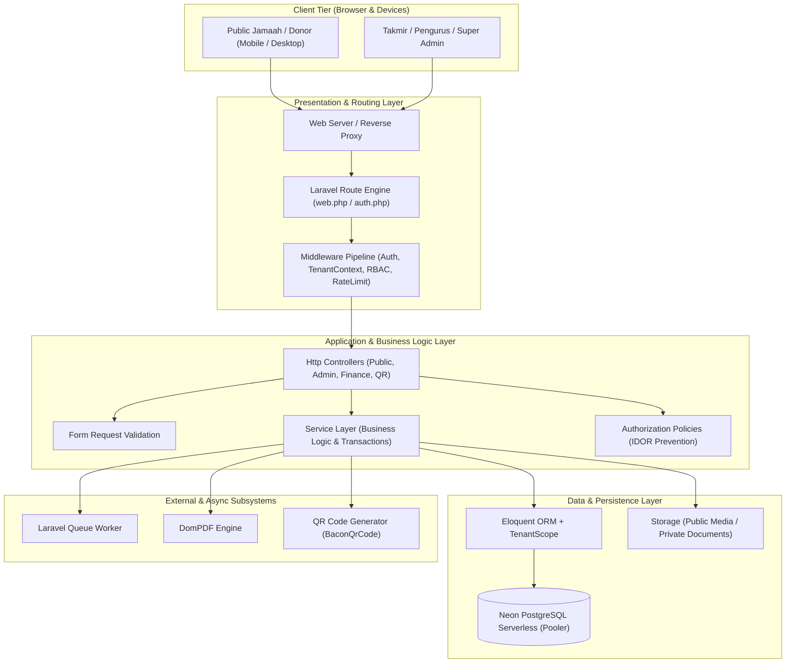
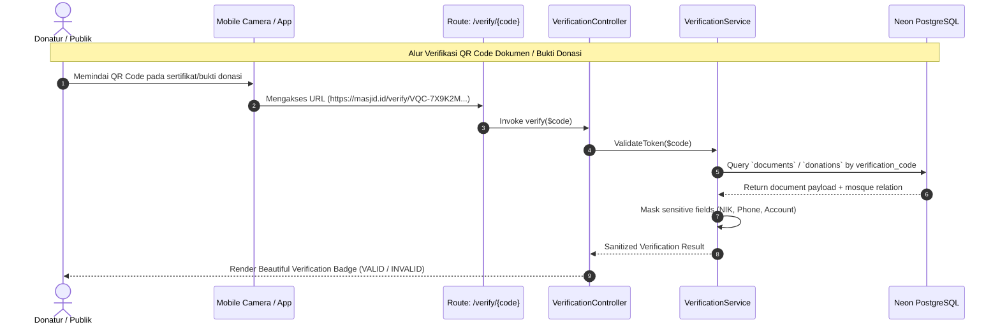

# SYSTEM DESIGN & ARCHITECTURE DOCUMENT
## MASJID INDONESIA — Digital Mosque Management Platform

**Document Version:** 1.0.0  
**Status:** Approved  
**Author:** Senior Software Architect & DevOps Engineer  
**Tech Stack:** Laravel (PHP 8.3+), Neon PostgreSQL, Blade, Tailwind CSS, Alpine.js, Livewire  

---

## 1. APPLICATION ARCHITECTURE OVERVIEW

MASJID INDONESIA dirancang menggunakan prinsip **Modular Monolith & Layered Clean Architecture** dengan fondasi framework Laravel modern. Arsitektur ini memastikan pemisahan tanggung jawab (*separation of concerns*), performa tinggi, kemudahan pengujian (*testability*), dan kesiapan bertransformasi menjadi platform SaaS multi-masjid skala nasional.



---

## 2. MULTI-TENANT ARCHITECTURE (TENANT = MOSQUE)

### 2.1 Multi-Tenant Strategy
MASJID INDONESIA menerapkan model **Shared Database, Shared Schema (Tenant Column Scoping)**:
- Setiap entitas data operasional (kegiatan, donasi, kas, inventaris, pengurus, dll.) memiliki kolom `mosque_id` (UUID foreign key).
- Isolasi data dijamin pada **level framework/database query**, bukan hanya menyembunyikan elemen antarmuka (UI).

```mermaid
graph LR
    Req[Incoming HTTP Request] --> TenantMW[TenantResolutionMiddleware]
    TenantMW --> SetContext[App::setTenantContext(mosque_id)]
    SetContext --> GlobalScope[Eloquent TenantScope (Auto WHERE mosque_id = ?)]
    GlobalScope --> SafeQuery[PostgreSQL Isolated Result]
```

### 2.2 Tenant Context & TenantScope
1. **Tenant Middleware (`SetMosqueContextMiddleware`):**
   - Mendeteksi `mosque_id` dari sesi user yang login, header request, atau parameter rute (untuk public portal slug `/masjid/{slug}`).
   - Mendaftarkan ID masjid ke singleton `TenantManager`.
2. **Global Tenant Scope (`TenantScope`):**
   - Diimplementasikan pada seluruh Model Eloquent yang mengimplementasikan interface `BelongsToMosque`.
   - Secara otomatis menyisipkan clause `WHERE mosque_id = ?` pada setiap query `SELECT`, `UPDATE`, dan `DELETE`.
   - Dikecualikan (*bypassed*) secara eksplisit hanya bila dipanggil oleh user ber-role `SUPER_ADMIN` atau saat proses registrasi awal.

---

## 3. BACKEND ARCHITECTURE & DIRECTORY BLUEPRINT

### 3.1 Layer Separation
```text
app/
├── Http/
│   ├── Controllers/
│   │   ├── Admin/           # Controller operasional takmir masjid
│   │   ├── Public/          # Controller halaman publik portal
│   │   ├── Finance/         # Controller kas & transaksi keuangan
│   │   ├── Donation/        # Controller penggalangan dana & infaq
│   │   ├── SuperAdmin/      # Controller platform SaaS nasional
│   │   └── Verification/    # Controller scan QR & verifikasi dokumen
│   ├── Middleware/
│   │   ├── EnsureUserBelongsToMosque.php
│   │   ├── SetMosqueContext.php
│   │   └── AuditLogActivity.php
│   └── Requests/            # Form Requests dengan strict validation rules
├── Models/                  # Eloquent Models dengan UUID & Relationships
├── Services/                # Service Layer (Business logic, calculations, workflow)
│   ├── MosqueService.php
│   ├── FinanceService.php
│   ├── DonationService.php
│   ├── PrayerScheduleService.php
│   ├── ApprovalWorkflowService.php
│   └── VerificationService.php
├── Policies/                # Kebijakan otorisasi per-resource
├── Scopes/
│   └── TenantScope.php      # Global scope isolasi tenant
└── Support/
    ├── Enums/               # PHP 8.3 Backed Enums
    └── Traits/
        ├── BelongsToMosque.php
        ├── HasUuid.php
        └── Auditable.php
```

### 3.2 Request Lifecycle Flow
$$\text{User Action} \longrightarrow \text{Routing} \longrightarrow \text{Middleware (Auth + Tenant)} \longrightarrow \text{FormRequest} \longrightarrow \text{Controller} \longrightarrow \text{Service Layer} \longrightarrow \text{Eloquent + Neon DB}$$

---

## 4. FRONTEND ARCHITECTURE

1. **Core UI Engine:** **Blade Templates + Tailwind CSS (v3/v4) + Vite**
   - Rendering server-side cepat dengan first-contentful paint (FCP) optimal.
   - Komponen UI modular: `<x-button>`, `<x-card>`, `<x-badge>`, `<x-modal>`, `<x-navbar>`.
2. **Interaktivitas Ringan:** **Alpine.js**
   - Digunakan untuk interaksi antarmuka sisi klien: dropdown menu, tab switching, modal popup, image preview upload, format rupiah real-time.
3. **Komponen Dinamis Kompleks:** **Livewire 3**
   - Digunakan untuk kalkulator zakat interaktif, pencarian cepat data jamaah (instant search), dan filter tabel transaksi kas tanpa reload halaman penuh.
4. **Visualisasi Data & Grafik:** **Chart.js / ApexCharts**
   - Menampilkan grafik arus kas bulanan, komposisi pemasukan vs pengeluaran, dan tren perolehan donasi.
5. **Iconography:** **Lucide Icons** (clean, modern, lightweight SVG icons).

---

## 5. DATABASE & NEON POSTGRESQL INTEGRATION

### 5.1 Connection Architecture
- Database menggunakan **Neon PostgreSQL Serverless**.
- Koneksi diatur menggunakan pooler URL dengan `sslmode=require` dan `channel_binding=require` untuk efisiensi koneksi pooling dan keamanan transmisi TLS.
- Primary key menggunakan **UUIDv7 / UUIDv4** untuk memastikan tidak ada ketergantungan sekuensial dan keamanan dari enumerasi URL (anti-IDOR).

### 5.2 Indexing Strategy
- Setiap tabel tenant memiliki compound index: `INDEX (mosque_id, created_at)` dan `INDEX (mosque_id, status)`.
- Index unik untuk pencarian cepat: `UNIQUE (mosque_id, slug)` atau `UNIQUE (verification_code)`.

---

## 6. QR CODE & VERIFICATION ENGINE ARCHITECTURE



- **Token Generation:** 32-karakter URL-safe cryptographically secure random string (`Str::random(32)` atau hash HMAC).
- **Zero-Knowledge Privacy:** Publik hanya melihat validitas dokumen, nama masjid, jenis transaksi, tanggal, dan inisial donatur.

---

## 7. APPROVAL & AUDIT TRAIL WORKFLOW ARCHITECTURE

### 7.1 Multi-Tier Approval Workflow
Pengajuan dana, perbaikan inventaris, atau kegiatan masjid melalui state machine:

$$\text{DRAFT} \xrightarrow{\text{Submit}} \text{SUBMITTED} \xrightarrow{\text{Review}} \text{TREASURER\_REVIEW} \xrightarrow{\text{Approve}} \text{CHAIRMAN\_APPROVED} \xrightarrow{\text{Disburse}} \text{COMPLETED}$$

### 7.2 Audit Log Architecture
Setiap aksi krusial (perubahan transaksi kas, perubahan status pengajuan, mutasi peran staf, pencetakan dokumen) otomatis memicu event listener `LogAuditEvent`:
- Menyimpan: `user_id`, `mosque_id`, `event_type`, `auditable_type`, `auditable_id`, `old_values` (JSON), `new_values` (JSON), `ip_address`, `user_agent`.

---

## 8. REPORTING & DIGITAL ASSET GENERATION

- **PDF Generation Engine:** `barryvdh/laravel-dompdf` dengan template Blade khusus A4 (orientasi portrait & landscape), terintegrasi watermark resmi masjid dan QR verification stamp.
- **Spreadsheet Export:** `maatwebsite/excel` (PhpSpreadsheet) untuk ekspor buku besar kas, daftar inventaris, dan rekap mustahiq.
- **Media Management:** Spatie Media Library atau custom storage abstraction mengisolasi berkas publik (`/public/media/{mosque_id}/*`) dan berkas rahasia/nota kas (`/private/receipts/{mosque_id}/*`).
