# DATABASE ERD & SCHEMA SPECIFICATION (POSTGRESQL)
## MASJID INDONESIA — Digital Mosque Management Platform

**Document Version:** 1.0.0  
**Database Engine:** PostgreSQL 16+ (Neon Serverless)  
**Primary Key Standard:** UUIDv7 / UUIDv4  
**Multi-Tenant Scoping:** `mosque_id` (UUID foreign key) on all tenant-bound tables  

---

## 1. ENTITY RELATIONSHIP DIAGRAM (HIGH-LEVEL MERMAID)

```mermaid
erDiagram
    users ||--o{ mosque_staff : "assigned as"
    users ||--o{ audit_logs : "triggers"
    mosques ||--|| mosque_profiles : "has"
    mosques ||--o{ mosque_facilities : "maintains"
    mosques ||--o{ mosque_staff : "employs"
    mosques ||--o{ prayer_schedules : "schedules"
    mosques ||--o{ events : "organizes"
    mosques ||--o{ news : "publishes"
    mosques ||--o{ announcements : "broadcasts"
    mosques ||--o{ congregations : "manages"
    mosques ||--o{ donors : "records"
    mosques ||--o{ donation_campaigns : "launches"
    donation_campaigns ||--o{ donations : "receives"
    donations ||--o{ donation_payments : "processed via"
    mosques ||--o{ financial_transactions : "records"
    income_categories ||--o{ financial_transactions : "categorizes"
    expense_categories ||--o{ financial_transactions : "categorizes"
    mosques ||--o{ social_programs : "runs"
    social_programs ||--o{ social_distributions : "distributes"
    social_recipients ||--o{ social_distributions : "receives"
    mosques ||--o{ zakat_payments : "collects"
    mosques ||--o{ waqf_donations : "manages"
    mosques ||--o{ inventories : "owns"
    inventories ||--o{ maintenance_records : "serviced in"
    mosques ||--o{ books : "shelves"
    books ||--o{ book_loans : "lent via"
    mosques ||--o{ imam_schedules : "assigns"
    mosques ||--o{ khatib_schedules : "assigns"
    mosques ||--o{ submissions : "processes"
    submissions ||--o{ submission_reviews : "reviewed via"
    mosques ||--o{ documents : "issues"
    documents ||--o{ qr_codes : "verified via"
    mosques ||--o{ subscriptions : "subscribes"
    subscription_plans ||--o{ subscriptions : "defines"
```

---

## 2. DETAILED TABLE SCHEMAS

### 2.1 Core Identity & Multi-Tenancy

#### `users`
| Column | Type | Attributes | Description |
|---|---|---|---|
| `id` | `UUID` | `PK, DEFAULT gen_random_uuid()` | Unique user identifier |
| `mosque_id` | `UUID` | `FK -> mosques.id, NULLABLE` | Active tenant context (null for Super Admin) |
| `name` | `VARCHAR(255)` | `NOT NULL` | Full legal/display name |
| `email` | `VARCHAR(255)` | `NOT NULL, UNIQUE` | Login email address |
| `phone_number` | `VARCHAR(30)` | `NULLABLE, INDEX` | WhatsApp / phone contact |
| `avatar_url` | `VARCHAR(500)` | `NULLABLE` | Profile photo path |
| `password` | `VARCHAR(255)` | `NOT NULL` | Argon2id / Bcrypt hashed password |
| `email_verified_at`| `TIMESTAMP` | `NULLABLE` | Email verification timestamp |
| `is_active` | `BOOLEAN` | `DEFAULT TRUE, INDEX` | Account active flag |
| `last_login_at` | `TIMESTAMP` | `NULLABLE` | Last authenticated timestamp |
| `created_at` | `TIMESTAMP` | `DEFAULT CURRENT_TIMESTAMP` | Record creation date |
| `updated_at` | `TIMESTAMP` | `DEFAULT CURRENT_TIMESTAMP` | Record last update date |
| `deleted_at` | `TIMESTAMP` | `NULLABLE` | Soft delete timestamp |

#### `mosques`
| Column | Type | Attributes | Description |
|---|---|---|---|
| `id` | `UUID` | `PK, DEFAULT gen_random_uuid()` | Unique mosque identifier |
| `kemenag_id` | `VARCHAR(50)` | `NULLABLE, UNIQUE` | SIMAS / Kemenag official registry ID |
| `name` | `VARCHAR(255)` | `NOT NULL, INDEX` | Official mosque name |
| `slug` | `VARCHAR(255)` | `NOT NULL, UNIQUE` | SEO friendly URL identifier |
| `type` | `VARCHAR(50)` | `NOT NULL, INDEX` | `RAYA`, `AGUNG`, `BESAR`, `JAMI`, `MUSHOLLA` |
| `status` | `VARCHAR(30)` | `DEFAULT 'PENDING', INDEX` | `PENDING`, `VERIFIED`, `SUSPENDED` |
| `email` | `VARCHAR(255)` | `NULLABLE` | Official contact email |
| `phone` | `VARCHAR(50)` | `NULLABLE` | Secretariat phone |
| `address_line` | `TEXT` | `NOT NULL` | Street address |
| `province` | `VARCHAR(100)` | `NOT NULL, INDEX` | Provinsi |
| `city` | `VARCHAR(100)` | `NOT NULL, INDEX` | Kabupaten / Kota |
| `district` | `VARCHAR(100)` | `NOT NULL` | Kecamatan |
| `village` | `VARCHAR(100)` | `NOT NULL` | Kelurahan / Desa |
| `postal_code` | `VARCHAR(10)` | `NULLABLE` | Kode Pos |
| `latitude` | `DECIMAL(10,8)` | `NULLABLE` | Geo Latitude |
| `longitude` | `DECIMAL(11,8)` | `NULLABLE` | Geo Longitude |
| `logo_url` | `VARCHAR(500)` | `NULLABLE` | Official logo path |
| `banner_url` | `VARCHAR(500)` | `NULLABLE` | Header banner hero image |
| `bank_accounts` | `JSONB` | `NULLABLE` | Bank details (Array of bank, account, name) |
| `qris_url` | `VARCHAR(500)` | `NULLABLE` | Static QRIS image path |
| `verified_at` | `TIMESTAMP` | `NULLABLE` | Platform verification timestamp |
| `created_at` | `TIMESTAMP` | `DEFAULT CURRENT_TIMESTAMP` | |
| `updated_at` | `TIMESTAMP` | `DEFAULT CURRENT_TIMESTAMP` | |
| `deleted_at` | `TIMESTAMP` | `NULLABLE` | |

#### `mosque_profiles`
| Column | Type | Attributes | Description |
|---|---|---|---|
| `id` | `UUID` | `PK` | Unique profile ID |
| `mosque_id` | `UUID` | `FK -> mosques.id, UNIQUE, ON DELETE CASCADE` | Mosque relation |
| `history` | `TEXT` | `NULLABLE` | Sejarah pendirian masjid |
| `vision` | `TEXT` | `NULLABLE` | Visi masjid |
| `mission` | `JSONB` | `NULLABLE` | Daftar butir misi masjid |
| `capacity` | `INTEGER` | `DEFAULT 0` | Daya tampung jamaah |
| `land_area_sqm` | `DECIMAL(10,2)`| `NULLABLE` | Luas tanah (m2) |
| `building_area_sqm`| `DECIMAL(10,2)`| `NULLABLE` | Luas bangunan (m2) |
| `legal_status` | `VARCHAR(100)` | `NULLABLE` | Status tanah (Wakaf, Sertifikat Hak Milik, dll.) |
| `social_media` | `JSONB` | `NULLABLE` | Link Facebook, Instagram, YouTube, Website |
| `created_at` | `TIMESTAMP` | | |
| `updated_at` | `TIMESTAMP` | | |

#### `mosque_facilities`
| Column | Type | Attributes | Description |
|---|---|---|---|
| `id` | `UUID` | `PK` | Facility record ID |
| `mosque_id` | `UUID` | `FK -> mosques.id, INDEX` | |
| `name` | `VARCHAR(150)` | `NOT NULL` | E.g. 'Tempat Wudhu Pria', 'Genset 50kVA' |
| `category` | `VARCHAR(50)` | `NOT NULL, INDEX` | `IBADAH`, `SANITASI`, `MULTIMEDIA`, `AKSESIBILITAS`, `UMUM` |
| `quantity` | `INTEGER` | `DEFAULT 1` | Jumlah unit |
| `condition` | `VARCHAR(30)` | `DEFAULT 'EXCELLENT'` | `EXCELLENT`, `GOOD`, `FAIR`, `POOR` |
| `description` | `TEXT` | `NULLABLE` | Detail spesifikasi & lokasi |
| `icon` | `VARCHAR(50)` | `NULLABLE` | Lucide icon identifier |
| `created_at` | `TIMESTAMP` | | |
| `updated_at` | `TIMESTAMP` | | |

#### `mosque_staff` & `staff_positions`
| Column | Type | Attributes | Description |
|---|---|---|---|
| `id` | `UUID` | `PK` | |
| `mosque_id` | `UUID` | `FK -> mosques.id, INDEX` | |
| `user_id` | `UUID` | `FK -> users.id, NULLABLE` | Optional linked user account |
| `name` | `VARCHAR(255)` | `NOT NULL` | Nama pengurus |
| `position` | `VARCHAR(100)` | `NOT NULL, INDEX` | Ketua, Wakil, Sekretaris, Bendahara, dll. |
| `department` | `VARCHAR(100)` | `NULLABLE` | Bidang / Seksi (Idarah, Imarah, Ri'ayah) |
| `period_start` | `INTEGER` | `NOT NULL` | Tahun mulai periode |
| `period_end` | `INTEGER` | `NOT NULL` | Tahun selesai periode |
| `phone_number` | `VARCHAR(30)` | `NULLABLE` | Kontak pengurus |
| `photo_url` | `VARCHAR(500)` | `NULLABLE` | Foto resmi pengurus |
| `is_active` | `BOOLEAN` | `DEFAULT TRUE` | |
| `created_at` | `TIMESTAMP` | | |
| `updated_at` | `TIMESTAMP` | | |

---

### 2.2 Ibadah, Petugas & Syiar

#### `prayer_settings` & `prayer_schedules`
- `prayer_settings`: `(id PK, mosque_id FK UNIQUE, calculation_method, fajr_angle, isha_angle, dhuhr_offset_minutes, asr_offset_minutes, maghrib_offset_minutes, isha_offset_minutes, fajr_offset_minutes, iqamah_delay_minutes JSONB)`.
- `prayer_schedules`: `(id PK, mosque_id FK, schedule_date DATE UNIQUE(mosque_id, schedule_date), imsak, fajr, sunrise, dhuhr, asr, maghrib, isha)`.

#### `imam_schedules`, `khatib_schedules`, `muadzin_schedules`
- `(id PK, mosque_id FK, schedule_date DATE, prayer_name VARCHAR, assigned_name VARCHAR, phone VARCHAR, user_id FK NULLABLE, status VARCHAR 'CONFIRMED'/'PENDING'/'REPLACED', substitute_name VARCHAR NULLABLE, notes TEXT)`.

#### `khutbahs`
- `(id PK, mosque_id FK, title VARCHAR, preacher_name VARCHAR, delivery_date DATE, theme VARCHAR, content TEXT, audio_video_url VARCHAR, pdf_attachment_url VARCHAR, is_published BOOLEAN DEFAULT TRUE)`.

#### `events`, `event_categories`, `event_speakers`
- `events`: `(id PK, mosque_id FK, category_id FK, title VARCHAR, slug VARCHAR, speaker_name VARCHAR, speaker_title VARCHAR, start_datetime TIMESTAMP, end_datetime TIMESTAMP, location VARCHAR, description TEXT, banner_url VARCHAR, max_participants INTEGER, is_registration_open BOOLEAN, status VARCHAR 'UPCOMING'/'ONGOING'/'COMPLETED'/'CANCELLED')`.

#### `news`, `news_categories`, `announcements`
- `news`: `(id PK, mosque_id FK, category_id FK, title VARCHAR, slug VARCHAR, summary TEXT, content TEXT, cover_image_url VARCHAR, is_published BOOLEAN, published_at TIMESTAMP, views_count INTEGER DEFAULT 0)`.
- `announcements`: `(id PK, mosque_id FK, title VARCHAR, body TEXT, priority VARCHAR 'NORMAL'/'HIGH'/'URGENT', is_pinned BOOLEAN, start_date DATE, end_date DATE, is_active BOOLEAN)`.

---

### 2.3 Donasi & Keuangan

#### `donation_campaigns`
| Column | Type | Attributes | Description |
|---|---|---|---|
| `id` | `UUID` | `PK` | |
| `mosque_id` | `UUID` | `FK -> mosques.id, INDEX` | |
| `title` | `VARCHAR(255)` | `NOT NULL` | Judul campaign |
| `slug` | `VARCHAR(255)` | `NOT NULL` | Slug URL |
| `category` | `VARCHAR(50)` | `NOT NULL` | `INFAQ`, `WAKAF`, `YATIM`, `RENOVASI`, `RAMADHAN` |
| `target_amount` | `NUMERIC(15,2)`| `NULLABLE` | Target nominal |
| `collected_amount`| `NUMERIC(15,2)`| `DEFAULT 0.00` | Akumulasi terkumpul |
| `donor_count` | `INTEGER` | `DEFAULT 0` | Jumlah donatur |
| `start_date` | `DATE` | `NOT NULL` | |
| `end_date` | `DATE` | `NULLABLE` | |
| `cover_image_url`| `VARCHAR(500)` | `NULLABLE` | |
| `description` | `TEXT` | `NOT NULL` | |
| `is_featured` | `BOOLEAN` | `DEFAULT FALSE` | |
| `status` | `VARCHAR(30)` | `DEFAULT 'ACTIVE'` | `ACTIVE`, `COMPLETED`, `PAUSED` |

#### `donations` & `donation_payments`
- `donations`: `(id PK, mosque_id FK, campaign_id FK NULLABLE, donor_name VARCHAR, donor_phone VARCHAR, donor_email VARCHAR, is_anonymous BOOLEAN, amount NUMERIC(15,2), doa_message TEXT, status VARCHAR 'PENDING'/'PAID'/'VERIFIED'/'CANCELLED', payment_method VARCHAR, verification_code VARCHAR(64) UNIQUE INDEX, verified_at TIMESTAMP, verified_by_id FK users)`.
- `donation_payments`: `(id PK, donation_id FK, payment_gateway VARCHAR, transaction_ref VARCHAR, amount NUMERIC(15,2), proof_file_url VARCHAR, payload JSONB, paid_at TIMESTAMP)`.

#### `income_categories`, `expense_categories`, `financial_transactions`
- `income_categories` & `expense_categories`: `(id PK, mosque_id FK, name VARCHAR, code VARCHAR, description TEXT)`.
- `financial_transactions`:
  - `id PK UUID`
  - `mosque_id FK UUID INDEX`
  - `transaction_type VARCHAR(20) NOT NULL ('INCOME' | 'EXPENSE')`
  - `income_category_id FK NULLABLE`
  - `expense_category_id FK NULLABLE`
  - `amount NUMERIC(15,2) NOT NULL`
  - `transaction_date DATE NOT NULL INDEX`
  - `reference_number VARCHAR(100) NULLABLE`
  - `description TEXT NOT NULL`
  - `recipient_or_payer VARCHAR(255) NULLABLE`
  - `payment_channel VARCHAR(50) DEFAULT 'CASH' ('CASH' | 'BANK_TRANSFER' | 'QRIS')`
  - `proof_attachment_url VARCHAR(500) NULLABLE`
  - `recorded_by_id FK users.id`
  - `verified_by_id FK users.id NULLABLE`
  - `status VARCHAR(30) DEFAULT 'APPROVED' ('DRAFT' | 'PENDING_REVIEW' | 'APPROVED' | 'REJECTED')`
  - `created_at, updated_at, deleted_at`

---

### 2.4 Program Sosial, ZISWAF & Inventaris

#### `social_programs`, `social_recipients`, `social_distributions`
- `social_programs`: `(id PK, mosque_id FK, name VARCHAR, description TEXT, budget NUMERIC(15,2), start_date DATE, end_date DATE, status VARCHAR)`.
- `social_recipients`: `(id PK, mosque_id FK, full_name VARCHAR, nik_hash VARCHAR, category VARCHAR 'FAKIR'/'MISKIN'/'YATIM'/'DHUAFA', address TEXT, phone VARCHAR, status VARCHAR 'ACTIVE'/'INACTIVE')`.
- `social_distributions`: `(id PK, program_id FK, recipient_id FK, distribution_date DATE, package_description TEXT, nominal_value NUMERIC(15,2), proof_photo_url VARCHAR, distributed_by_id FK users)`.

#### `zakat_programs` & `zakat_payments`
- `zakat_payments`: `(id PK, mosque_id FK, muzakki_name VARCHAR, muzakki_phone VARCHAR, zakat_type VARCHAR 'FITRAH_BERAS'/'FITRAH_UANG'/'MAAL'/'FIDYAH', quantity_kg DECIMAL(6,2), amount_rupiah NUMERIC(15,2), souls_count INTEGER, payment_date DATE, verification_code VARCHAR(64) UNIQUE, received_by_id FK users)`.

#### `inventories`, `inventory_categories`, `maintenance_records`
- `inventories`: `(id PK, mosque_id FK, category_id FK, item_code VARCHAR UNIQUE(mosque_id, item_code), name VARCHAR, quantity INTEGER, unit VARCHAR, acquisition_date DATE, acquisition_source VARCHAR 'PURCHASE'/'WAQF'/'DONATION', acquisition_cost NUMERIC(15,2), room_location VARCHAR, condition VARCHAR 'GOOD'/'FAIR'/'POOR'/'BROKEN', notes TEXT)`.
- `maintenance_records`: `(id PK, inventory_id FK, maintenance_date DATE, issue_description TEXT, action_taken TEXT, vendor_name VARCHAR, cost NUMERIC(15,2), next_maintenance_date DATE, status VARCHAR 'IN_PROGRESS'/'COMPLETED')`.

---

### 2.5 Perpustakaan (Library) & Sirkulasi

#### `books`, `book_categories`, `book_loans`
- `books`: `(id PK, mosque_id FK, category_id FK, book_code VARCHAR, title VARCHAR, author VARCHAR, publisher VARCHAR, year_published INTEGER, language VARCHAR, copies_total INTEGER, copies_available INTEGER, shelf_location VARCHAR)`.
- `book_loans`: `(id PK, book_id FK, congregation_id FK NULLABLE, borrower_name VARCHAR, borrower_phone VARCHAR, loan_date DATE, due_date DATE, return_date DATE NULLABLE, status VARCHAR 'BORROWED'/'RETURNED'/'OVERDUE'/'LOST')`.

---

### 2.6 Pengajuan, Pemeriksaan & Verifikasi Dokumen

#### `submissions` & `submission_reviews`
- `submissions`: `(id PK, mosque_id FK, submission_number VARCHAR UNIQUE, category VARCHAR 'KEGIATAN'/'DANA'/'PEMBELIAN'/'SOSIAL'/'MAINTENANCE', title VARCHAR, proposed_amount NUMERIC(15,2) NULLABLE, description TEXT, attachment_url VARCHAR, applicant_id FK users, current_stage VARCHAR 'DRAFT'/'SUBMITTED'/'OPERATOR_REVIEW'/'TREASURER_REVIEW'/'CHAIRMAN_REVIEW'/'APPROVED'/'REJECTED'/'COMPLETED')`.
- `submission_reviews`: `(id PK, submission_id FK, reviewer_id FK users, stage VARCHAR, decision VARCHAR 'APPROVE'/'REJECT'/'REVISION_REQUESTED', notes TEXT, reviewed_at TIMESTAMP)`.

#### `documents` & `qr_codes`
- `documents`: `(id PK, mosque_id FK, document_number VARCHAR UNIQUE, document_type VARCHAR 'DONATION_RECEIPT'/'ZAKAT_RECEIPT'/'ACTIVITY_LETTER'/'RECOMMENDATION_LETTER', title VARCHAR, file_path VARCHAR, issuer_id FK users, verification_code VARCHAR(64) UNIQUE INDEX, issued_at TIMESTAMP, expires_at TIMESTAMP NULLABLE, is_revoked BOOLEAN DEFAULT FALSE, payload_snapshot JSONB)`.
- `qr_codes`: `(id PK, mosque_id FK, code_type VARCHAR 'MOSQUE_PROFILE'/'DONATION_CAMPAIGN'/'DOCUMENT_VERIFY', target_url VARCHAR, token VARCHAR(64) UNIQUE INDEX, scan_count INTEGER DEFAULT 0, created_at TIMESTAMP)`.

#### `audit_logs`
- `audit_logs`: `(id PK, mosque_id FK NULLABLE, user_id FK users NULLABLE, event_type VARCHAR(50), auditable_type VARCHAR(100), auditable_id UUID, old_values JSONB, new_values JSONB, ip_address VARCHAR(45), user_agent TEXT, created_at TIMESTAMP DEFAULT CURRENT_TIMESTAMP)`.

#### `subscription_plans` & `subscriptions`
- `subscription_plans`: `(id PK, name VARCHAR 'FREE'/'BASIC'/'PRO'/'ENTERPRISE', price_monthly NUMERIC(12,2), price_yearly NUMERIC(12,2), max_jamaah INTEGER, max_storage_mb INTEGER, features JSONB, is_active BOOLEAN)`.
- `subscriptions`: `(id PK, mosque_id FK UNIQUE, plan_id FK subscription_plans, status VARCHAR 'ACTIVE'/'EXPIRED'/'TRIAL', starts_at TIMESTAMP, ends_at TIMESTAMP, auto_renew BOOLEAN)`.
